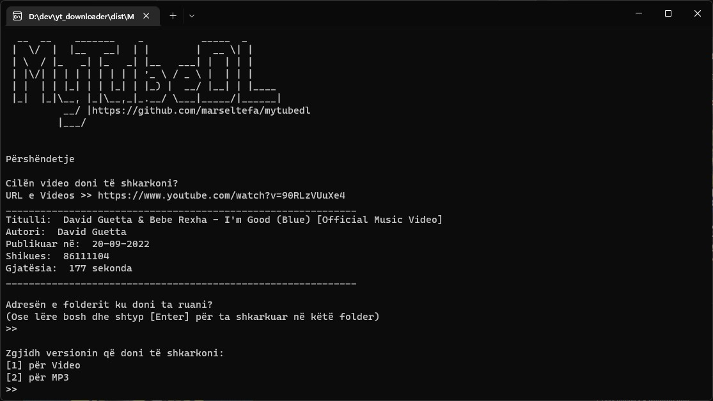

 

# <b>MyTubeDL</b> #

**Është një program i thjeshtë dhe i lehtë CLI pa interface që mundëson shkarkimin e videove ose MP3 në mënyrë të shpejtë nga YouTube.**

Mund ta shkarkoni [KËTU](https://github.com/marseltefa/mytubedl/releases) ⬇️

&nbsp;

  <a href="https://github.com/marseltefa/mytubedl/releases">

  
  <h3>Përdorimi</h3>
Përdorimi është shumë i thjeshtë ndiqni komandat në ekran, kopjoni URL e videos që doni të shkarkoni vendoseni në program pastaj shkruani adresën e folderit ku doni ta ruani ose lëreni bosh dhe shtypni enter për ta ruajtur në të njëjtin folder ku është programi dhe si përfundim zgjidhni nëse doni të shkarkoni videon shkruani 1 dhe jepini enter ose 2 nëse doni vetëm versionin audio MP3. Prisni sa të mbaroj shkarkimin dhe të merrni konfirmimin që u krye me sukses  
&nbsp;

 <h3>Info</h3>
 
Për videot programi do të shkarkojë resolucionin më të lartë të mundshëm por ka një limit që është 720p jo për faj të programit por për shkak të mënyrës se si funksionon YouTube pasi për videot me resolucion më të lartë se 720p audio dhe video ruhen veçmas dhe kërkon konvertim në PC e përdoruesit dhe disa codec për ti bashkuar bashkë.
